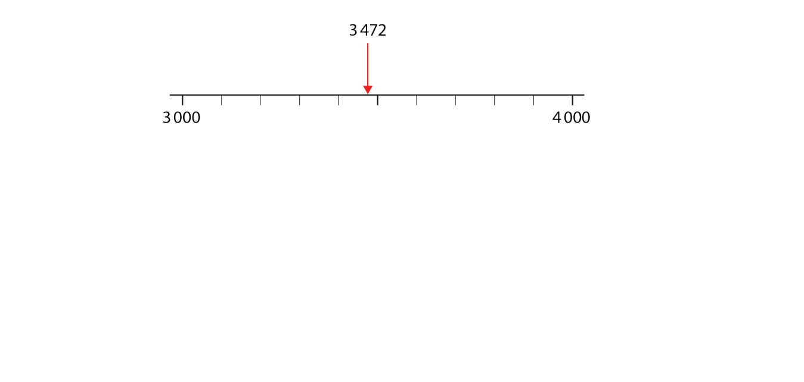
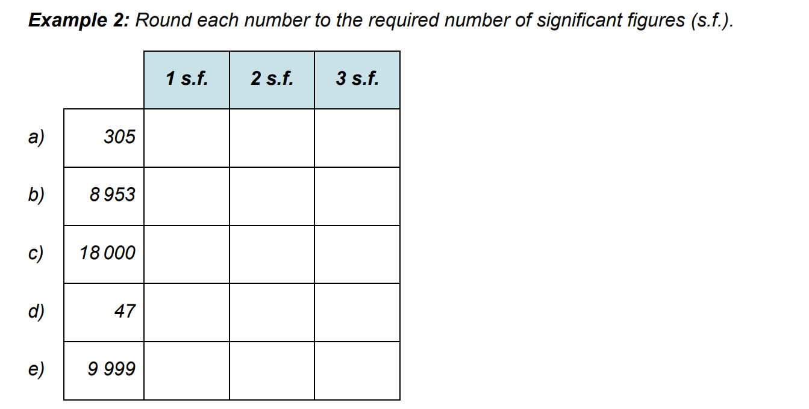
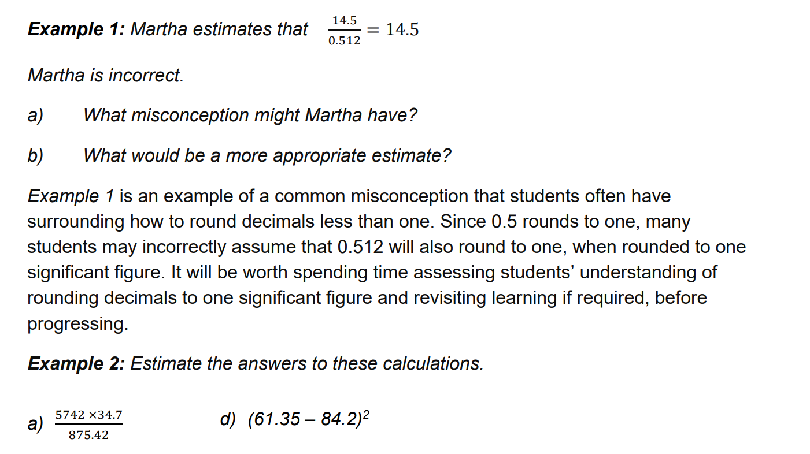
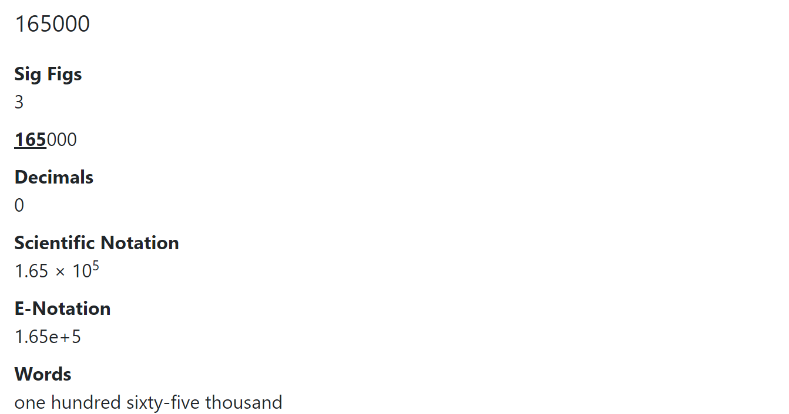
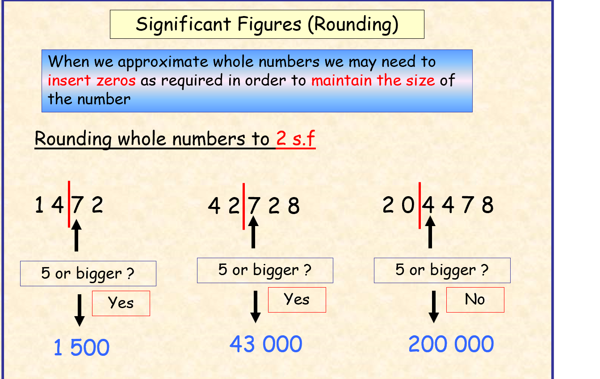

<h1>Rounding and estimating </h1>
<h4>What kind of things are we aiming for students to understand</h4>
<ul>
<li>enforce student understanding of the number placement system for denary i.e. powers of 10</li>
<li>work with real life scenarios using contextualised data</li>
<li>round to a specified number of significant figures</li>
<li>the effect of rounding errors when using a calculator or decimal values for modelling money</li>
</ul>

Check for prior understanding

Three pupils are asked to estimate the answer to the sum 4243 + 1734.
Andrew says, ‘To the nearest 100, the answer will be 5900.’ Bilal says, ‘To the
nearest 50, the answer will be 6000.’ Cheng says, ‘To the nearest 10, the
answer will be 5970.’ Do you agree with Andrew, Bilal or Cheng? Can you
explain their reasoning?

All non-zero digits are considered significant. For example, 91 has two significant figures (9 and 1), while 123.45 has five significant figures (1, 2, 3, 4, and 5). Zeros appearing between two non-zero digits (trapped zeros) are significant. ... For example, 0.00052 has two significant figures: 5 and 2.

a number line might help in visualising where a number is in relation to overall measurement

---

 try rounding some of the following stats 

<a href="https://www.internetlivestats.com"> Internet Stats </a>

